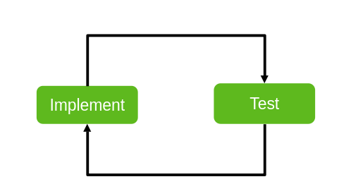
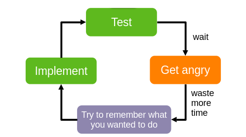
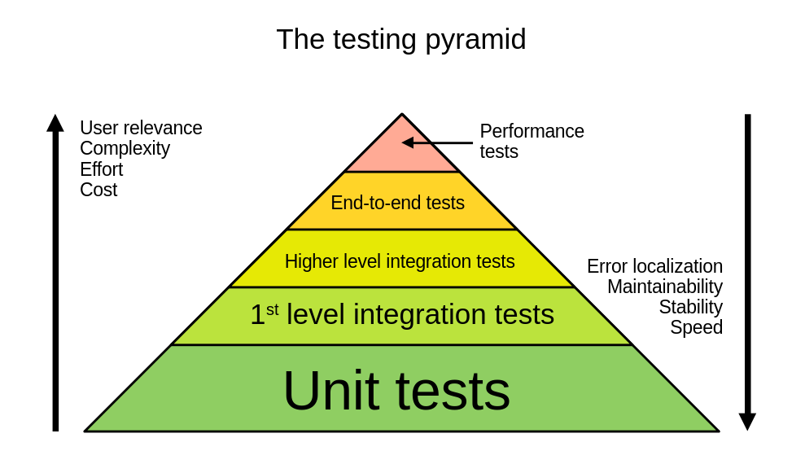

## Automatic Testing

Automatic testing means that your tests are code that runs without interaction. There are numerous advantages of automating your tests.

### Repetition is for Machines, not for People

Doing tests repeatedly by hand is a boring and mind-numbing task. You do it right the first time, sloppy the second time and later skip it anyway.

Also, let's be real: a modern computer can run thousands of unit tests in a second. In a second you don't even start to do the first manual test.

With end-to-end test it gets even worse. Even if a computer has to simulate all user interaction, a test including a UI is so fast that a spectator can't follow it, let alone be able to do it anywhere near as fast.

#### Get the Best out of Human Ingenuity

There is one area of testing that is predestined for manual testing: [Exploratory testing](https://en.wikipedia.org/wiki/Exploratory_testing)

If you have QA testers, don't ask them to mindlessly work down regression test scripts. Give them the task to break your system. Shine a light into the unexplored depths our your product. This will add real value for the quality of your software, since your testers will find obscure errors before curious customers do.

They write down which parts they explored, what steps they took and if they hit a bug, you have instructions for reproduction.

Of course, you don't force them to do the same test twice to validate that there is no regression. If your exploratory testing has findings, you write a regression test to make sure this does not pop up later again.

Penetration testing is a form of exploratory testing too. With the focus on getting your software to do things that it shouldn't be allowed to do.

### Speed Matters

In an ideal world an implementation round-trip looks like this:

The reality unfortunately often looks different.

It doesn't help that with long-running tests you try to make good use of the waiting time by switching to a different task.
This only adds to the mental burden that eats away at your productivity. Task switches take time, and they cost our brain a lot of energy.

You need to design your tests for speed in order to get the best out of the automation.

### Speed is Coverage

The faster your tests are, the more you can afford to run. If your tests are slow, you start cutting corners with test execution. You put off running the expensive ones more and more until your feedback loop reaches a point where the feedback from your tests comes too late to be relevant.

This is especially damaging when it comes to regression testing. You want to run those regression tests as often as possible &mdash; best case after each small change &mdash; in order to make sure you did not break any existing functionality.

## The Testing Pyramid

Software tests can be done on different levels. In this chapter we are going to discuss why each type has its merits and short-comings and why the question "which kind is most important" will always depend on the _target audience_ of a test.

You need a solid fundament of unit tests because unit tests:

1. &hellip; are very fast
2. &hellip; pinpoint error locations
3. &hellip; are robust to local changes (best case a single change makes one test red)
4. &hellip; have low maintenance effort

So your goal should be to test everything that you can with unit tests.

Unfortunately, unit tests are not enough. At some point you need to validate the interaction of your units with other units. And of course, you also want to make sure that everything works end-to-end.

The higher up you climb on the test pyramid, the more expensive, slow and fragile your tests get. "Fragile" means that a small change in the production code can flip a lot of integration tests and even more end-to-end tests. Expensive and fragile is also a really unpleasant combination. All of this goes to say that you should intentionally limit all tests to an as low level as is sufficient to prove correct operation.

[Test are an Executable Specification](test_are_an_executable_specification.md) &larr; | &uarr; [Introduction](introduction.md) |  &rarr; [TDD and BDD](tdd/tdd_and_bdd.md)