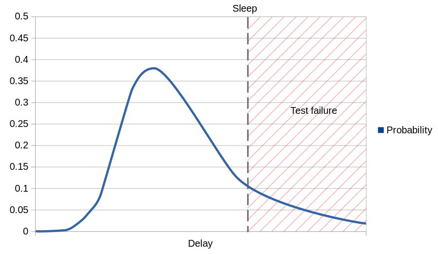

## Dealing With Randomness

Please take a look at the code below. Can you spot where you might have to be smart in your test? 

```java
class Role {
    private final Set<Permission> permissions;

    // ...
    
    public String toString() {
        if(permissions.isEmpty()) {
            return "Role: no permissions";
        }
        else {
            return "Role: "
                    + permissions.stream().map(p -> p.toString().toLowerCase()).collect(Collectors.joining(", "));
        }
    }
}
```

Sets are usually unordered in Java. That means you can't predict in which order the permissions will be displayed.

### Should I Enforce Ordering?

You can now either accept different orders or explicitly order the output.

Which variant you should pick depends on the situation.

#### Users Like Sorted Output

Here we have human-readable output of a concatenated set. Users normally prefer this kind of display to stay constant, so that reading is faster. So the easy fix here is to introduce `sort` in the stream.

```java
permissions.stream()
        .map(p -> p.toString().toLowerCase())
        .sort()
        .collect(Collectors.joining(", "))
```

We also don't need to worry much about losing performance here, since the list will always be very short.

#### If a Machine Processes Data, Don't Waste Resources

Imagine you have to do a full data export into CSV files, so that the files can later be imported into a database. The primary key is a date. Should you order the entries?

No. If the users need ordering, they can sort on the target database. The import process should not care about ordering. First of all ordering is inherently expensive, second if the import can cope with any order, that makes parallel import possible.

In short, don't waste effort on ordering if it is not an explicit requirement.

### Asserting Unordered Data

We now reached the point where we need to think about how to tackle unordered data in our tests.

A naive way for the CSV file export would be to do a sample check via a regular expression with repeating optional sections.

This approach is better than no test. But only slightly.

A better way would be to have an expected CSV output, compare line-by-line and _single_ match between expected and output line.

Obviously, that only works for small files, since this simple algorithm uses quadratic time O(n²). There are of course ways to make it more efficient, but remember we are talking about test code here.

If you need a mass data tests, consider the following approach:

1. Write one test with a small number of CSV lines, check for complete correctness
2. Write a test with mass data, and check a couple of derivative assertions
    * Assert expected overall number of lines
    * Assert total character count
    * Pick some samples and verify they are in the result
    * Validate the CSV syntax

### Assertion Libraries Can Deal With Unordered Data

Since database query results are usually unordered unless explicitly required in the query, verifying them can be quite annoying.

Before you start bothering yourself with that tedious task, first check if an existing assertion library maybe solved that issue for you.

Here are some examples:

* [assertj: `containsInAnyOrder`](https://www.javadoc.io/doc/org.assertj/assertj-core/latest/org/assertj/core/api/AbstractIterableAssert.html#containsExactlyInAnyOrder(ELEMENT...))
* [Hamcrest: `IsIterableContainingInAnyOrder`](https://hamcrest.org/JavaHamcrest/javadoc/2.2/org/hamcrest/collection/IsIterableContainingInAnyOrder.html)
* [Hamcrest Result Set Matcher: Ignoring the Order of the Result Rows](https://github.com/exasol/hamcrest-resultset-matcher/blob/main/doc/user_guide/user_guide.md#ignoring-the-order-of-the-result-rows)

### Randomness in Asynchronous Operations

Everyone who ever wrote a test against any kind of asynchronous interface knows that you will have to deal with randomness in timing.

#### Sleeping is Dangerous

The lazy approach is to throw in the odd `sleep` and hope for the best. This is a recipe for unreliable tests and wasting time, since there is nothing that guarantees that just because your wait was long enough when you wrote the test and executed it once, it will be long enough at any given other time.

It depends on factors like hardware, implementation and load how long an asynchronous operation takes. If you plot a distribution you will always see that there is a time limit that with any given system you will not be below. Unfortunately, you can't exactly say where that is. Then you will see some kind of distorted normal distribution. The tail towards the higher execution times is the source of many flaky tests. 



You can sleep longer, but the probability has the nasty habit not to go down to zero. You can argue that at some point an async call has to be considered defect if it takes too long and that might be true. In most cases however that is just a lazy excuse.

Sleeping a fixed amount of time also wastes testing time, because you in most cases wait longer than you need to. So you get a tradeoff between flakiness and speed of your tests.

All in all waiting for a fixed amount of time is asking for trouble, and you should avoid it completely.

#### Sequentialize Operations

Ab option that produces the least complex and therefore most readable code is if you enclose an asynchronous operation into code that turns it into a synchronous one.

Most asynchronous operations have accompanying interfaces through which you can determine when they are done. Best case in the same API. A typical example would be when the async call returns a job ID and you have a synchronous call that lets you check whether that job is complete.

#### Observing Derived System State to Monitor Async Operations

If you are less lucky, you need to observe derived information to determine the state of the async call. For example, the [Exasol Testcontainers](https://github.com/exasol/exasol-testcontainers) set up a [monitor that observes log entries](https://github.com/exasol/exasol-testcontainers/blob/main/src/main/java/com/exasol/bucketfs/testcontainers/LogBasedBucketFsMonitor.java) in a service to determine when a file is synchronized after upload.

The fact that this is necessary tells you that the feature in question was not written with testability in mind. Had it been written with a [test-first approach](tdd/first_steps_into_tdd.md), there would likely be an API to directly query synchronization state.

Beware of race conditions though! If you are using an unofficial interface as a last resort for determining operation state, better make sure that it does not race ahead of the actual operation's completion.

[Multiple Asserts in one Test Case](multiple_asserts_in_one_test_case.md) &larr; | &uarr; [Introduction](introduction.md)