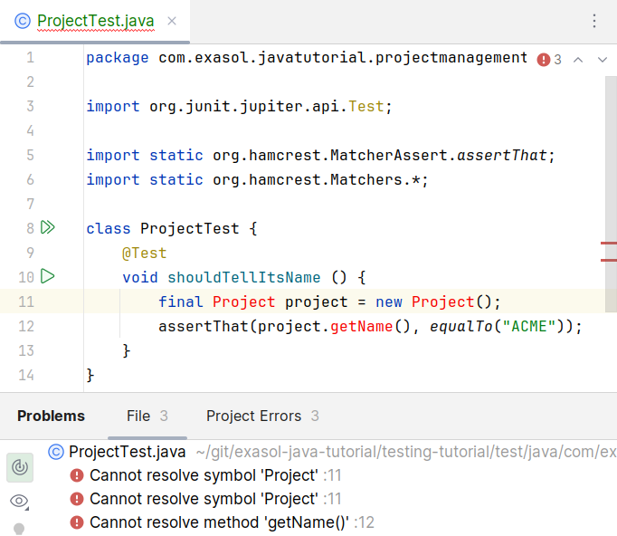
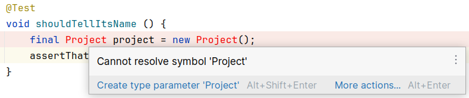
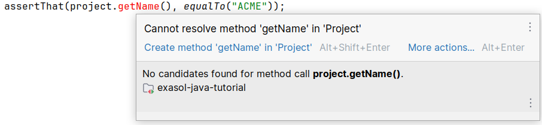
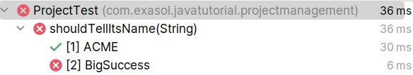
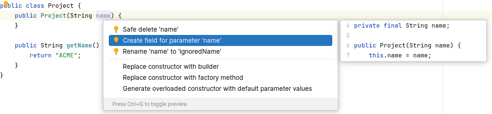
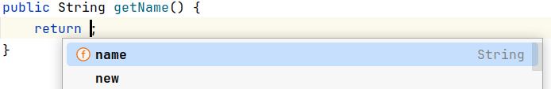

## First Steps Into TDD

Enough explanation, let's get our hands dirty. Your task in this section and the following will be to develop a simple project management system with users, project, project roles and permissions.

### The Right Tool for the job

We highly recommend you follow the example with a modern IDE like [IntelliJ](https://www.jetbrains.com/idea/) or [Eclipse](https://www.eclipse.org/).

Some people argue that TDD is more work than writing the tests after the implementation. This myth can quickly be debunked, given that you use an IDE that has a smart code generator, which will make building the implementation a breeze.

If you haven't done so already, please also familiarize yourself with [Apache Maven](https://maven.apache.org/) and [Hamcrest matchers](../matchers/hamcrest_matchers.md). We will use both throughout the tutorial.

### The Simplest Possible Thing

Unlike in a real project, where you start with the highest business value, we will first do the simplest possible thing so that we get a hang of the IDE's features.

Let's create a `User` class that allows us to get the username.

1. Create an empty Maven project called `projectmanagement` in your IDE.
2. Make sure that the IDE recognizes the typical path `src/main/java` as implementation root directory and `src/test/java` as tests root
3. Create a package `com.exasol.javatutorial.projectmanagement` in both your implementation and test sources
4. Create a test class `ProjectTest` in the package `com.exasol.javatutorial.projectmanagement` below the `src/test/java` directory

```java
package com.exasol.javatutorial.projectmanagement;

import org.junit.jupiter.api.Test;

import static org.hamcrest.MatcherAssert.assertThat;
import static org.hamcrest.Matchers.*;

class ProjectTest {
    @Test
    void shouldTellItsName () {
        final Project project = new Project();
        assertThat(project.getName(), equalTo("ACME"));
    }
}
```

### Resist the Urge to Implement More Than Required

If you are new to TDD, then a couple of things in the code above will immediately trigger you:

1. How am I supposed to test the class `Project` and its method `getName` when neither of those exist yet?
2. Why the heck can I test that the project name is "ACME", if I did not set it?

You can also see that your IDE shares your concerns.

Here is a screenshot from IntelliJ.



Remember that TDD is an iterative approach. We do start with the simplest possible thing and evolve from there.

### Red Then Green

The first thing in TDD that you do with any test is make sure that if fails. If it succeeds before we touched the implementation, the test is defect.

One thing is pretty sure, the test won't run until you fix the compiler errors, so let's do that, but without adding the actual implementation details.

1. Put your cursor on the class name `Project` in your test
2. Activate the auto-fix feature of your IDE (`[ALT] + [SHIFT] + [ENTER]` in IntelliJ or `[CTRL] + [1]` in Eclipse)
3. Let the IDE generate the class file for you

Here is another example of how that looks like in IntelliJ.



Okay. So far the generated class is quite unimpressive, but at least your IDE stopped complaining about its non-existence.

```java
package com.exasol.javatutorial.projectmanagement;

public class Project {
}
```

Please go back to your test class and resolve the missing `getName` method in the same way.



As a return value we intentionally take `null` for not. Remember, we `want` the test to fail for now.

```java
package com.exasol.javatutorial.projectmanagement;

public class Project {
    public String getName() {
        return null;
    }
}
```

Now it's time to run the test. Go to the test class and run it (IntelliJ `[CTRL] + [F10]`, Eclipse `[CTRL] + [ALT] + [X], [T]`).

And, the test fails as it should with an assertion error.

```
java.lang.AssertionError: 
Expected: "ACME"
     but: was null
```

### The Case for Testing Only Code That Compiles

If your test succeeds while the implementation does not compile, your test is obviously worthless. I read from some TDD proponents that non-compiling implementation is good enough for the required failing test though. I disagree on this point. Vehemently.

1. If you write a test first, you come from a place where the production code compiled. You can get the test to not compile, but that does not prove anything except that either test is broken or the dependencies to the production code are incomplete (like missing APIs).
2. There is a significant chance that simply fixing the compiler findings will get the test green _before_ you actually wrote the implementation. This is a classical example of a dangerous test. And that kind of test is _worse_ than no test, because it gives you a false sense of safety.

### The Minimal Implementation

Getting back to our evolution metaphor, when in Nature food on the ground gets scarce, evolution produces a Giraffe that can eat the leaves of tall trees. What evolution does not do, is giving that Giraffe gills just because being able to dive might come in handy at a later time.

Translate that to our software problem and the solution to get the test green is simply to return a constant.

```java
public class Project {
    public String getName() {
        return "ACME";
    }
}
```

When I held trainings about TDD that was usually the point were some trainees can't take it any longer and have to complain that this is a pointless endeavor, because the code does not do anything useful. My counterargument is that it absolutely does: it fulfills all the requirements that were formulated at this point in time. And fulfilling the requirements is what the code is for.

If you want the code to do more, you have to add the requirements for that and in TDD tests are the executable representation of requirements.

### Add Test, add Implementation, Repeat

Now, let's address that nagging voice that we need to come to production code that is actually useful.

As a first attempt, we introduce the project name as constructor argument in our test.

```java
class ProjectTest {
    @Test
    void shouldTellItsName () {
        final Project project = new Project("ACME");
        assertThat(project.getName(), equalTo("ACME"));
    }
}
```

Note that your IDE will tell you that `new Project("ACME")` uses a constructor that does not yet exist. Since we did not explicitly implement a constructor, Java made one for us and that has no arguments. Please use the quick-fix feature of your IDE to create a shell constructor with a String argument.

After the quick-fix the class `Project` now looks like this:

```java
public class Project {
    public Project(String name) {
    }

    public String getName() {
        return "ACME";
    }
}
```

Now run the test.

It's green.

Is that what we want? Absolutely not! **It should be red.** I made this example here intentionally to show you how quickly you can end up with a test that is dangerous, because it did not fail first.

Very observant developers might say that the fact that the test did not compile at first should have been warning enough. I disagree (see ["The Case for Testing Only Code That Compiles"](#the-case-for-testing-only-code-that-compiles)).

To fix this, we have to realize that we need to mutate the project name and see if that has an effect. I am a big fan of JUnit's `@ParameterizeTest` feature because it makes mutating values simple and easy to extend.

```java
class ProjectTest {
    @ParameterizedTest
    @ValueSource(strings = {"ACME", "BigSuccess"})
    void shouldTellItsName (final String expectedName) {
        final Project project = new Project(expectedName);
        assertThat(project.getName(), equalTo(expectedName));
    }
}
```

Now we have one test that succeeds and one that fails. As it should be.



Let's fix the production code. Please use the quick-fix feature of your IDE to introduce an instance variable (or 'field') for the so far unused constructor parameter. If you don't already, you should make it a habit to use the automatic refactoring capabilities of your IDE as much as possible, because it saves you from making mistakes.



You can now use auto-completion to replace the constant in 'getName' with the field `name`.



Now the test including all sub-tests with mutated values is green.