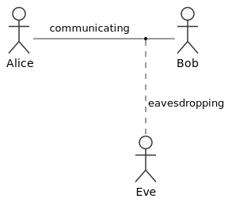

# An Introduction to TLS

Before we dive into the Exasol-specifics of TLS connections in the [next article](tls_with_exasol.md), let’s first discuss some TLS basics. We’ve created this introduction for people who want to get an idea about how TLS works. I am using metaphors and I will simplify a lot of the details to make the article more accessible for everyone. If you’re already a cryptography expert, you can skip directly to ["TLS With Exasol"](tls_with_exasol.md).

## What is TLS?

Transport Layer Security &mdash; or TLS &mdash; is the successor to the Secure Socket Layer (SSL). While being a [separate standard](https://tools.ietf.org/html/rfc5246), people have become so used to saying 'SSL' that they often use it as a synonym. For the sake of precision we are going to stick with TLS in this article.

Simply put, TLS is meant to protect network communication against eavesdropping and offers a mechanism to verify that the other end of the connection is the one you intended to reach.

Since people always have a wrong perception, I will stress that a TLS connection does not protect against malicious intent of your communication partner.

## Using TLS for Secure Communication

The job of TLS is to provide a secure communication channel between two partners.

What does 'secure' mean? Security is always composed of three components that together form the easy to remember acronym [CIA](https://en.wikipedia.org/wiki/Information_security#Key_concepts).

* Confidentiality
* Integrity
* Availability

Confidentiality, in this scenario, means that both partners can communicate without anyone else being able to eavesdrop on the conversation. But it doesn’t necessarily mean that other people don’t know that those two persons are having a conversation.

Integrity refers to the assurance that the content of the communication can’t be modified, without first alerting the communication partners. This means a recipient can rely on the fact that what she or he gets from the other communication partner is either what that person sent &mdash; or, if not, it will be flagged as having been manipulated.

Availability highlights that users should have access to a secure connection. This means the connection must work when it is needed, and it must be able to recover from channel outages. It should also be robust against any attackers' attempts to disrupt the communication.

## Alice, Bob and Eve

It is almost impossible to read about security and not come across these three people. They are [personas](https://en.wikipedia.org/wiki/Persona) meant to serve as a graphical example of the challenges involved in information security. Alice and Bob are two regular communication partners. The names were picked because of their initials A and B [see Rivest, Shamir, Adleman, 1978, p. 3](https://dspace.mit.edu/handle/1721.1/148910).

Eve on the other hand was chosen because it sounds sufficiently similar to eavesdropping and reminds readers that this persona wants get her hands on information that isn’t intended for her. We’re going to use those three established personas in our examples.

## Transport Layer Security and the OSI Model

TLS sits on top of the transport layer of the [OSI communication stack](https://en.wikipedia.org/wiki/OSI_model).

The OSI model classifies the typical building blocks of technical communication systems into seven layers.

| Layer  | Name               | Example          |
|:------:|--------------------|------------------|
|   7    | Application layer  | HTTP             |
|   6    | Presentation layer | TLS              |
|   5    | Session layer      | TLS              |
|   4    | Transport layer    | TCP              |
|   3    | Network layer      | IP               |
|   2    | Data link layer    | MAC              |
|   1    | Physical layer     | Network adapter  |

The most obvious one is the physical layer. Here you find the hardware and the physical communication channel like an optical fiber. The data link layer provides a point-to-point connection between two nodes. The network layer allows you to transfer data to other  nodes beyond that direct neighbor. It’s the job of the transport layer to make sure that the data arrives intact on the other side of the communication &mdash; especially if that data is too large to fit into a single transfer unit and needs to be split at the source, correctly reassembled at the sink.

The session layer is responsible for managing the connection state between communication partners. TLS has a session concept &mdash; so a part of TLS lives in this layer. The presentation layer is a translator between what the application expects and what the lower layers provide. In case of TLS,  this means encryption and decryption of application data.

The image above shows an example for an HTTPS connection. While you can see that the association between protocols and most layers is clear, TLS affects parts of both the session and presentation layer.

## The Life Cycle of a TLS Connection

The following sections will touch the most important aspects of a TLS connection. Please note, the details can be very tricky and for many of the steps there are multiple possible variants &mdash; for example, different encryption algorithms can be used.

### Initial Connection

Before TLS comes into play, we need an IP and a TCP connection between the two communication partners. That means that a TLS connection first starts via an unsecured connection.

As a consequence, the communication partners need to remember all messages they exchange and verify them later.

#### TLS Handshake

Before Alice and Bob can start their actual conversation, they first need to establish the secure communication. This is called the ‘TLS handshake’.

Alice and Bob add random data and a timestamp to the first messages of the communication, in order to prevent so called ‘replay attacks’. In a replay attack, Eve records a communication and tries to take over the next one by replaying the recorded messages. Since the random data and timestamp change each time, Eve’s attack fails.

Now the communication partners establish each other’s authenticity &mdash; or more precisely they should. We’ll get to that in a minute. For now, you just need to be aware that the goal of this step is to make sure that the communication partners are who they claim to be. The driving technology behind this step is called public-key cryptography or asymmetric cryptography.

Think of a box with a lock that needs two keys &mdash; one for locking it and one for unlocking it. Bob can give copies of the locking key to anyone he likes, Alice for example. As long as Bob keeps the other key, only he can open the box to get out what other people put in.

In cryptographic terms we speak of a private key and a public key. As the name suggests, Bob needs to keep the private key secret and can share the other one. Bob could theoretically post the public key on Twitter without compromising security. But there are better ways to do this, and we will discuss them later.

Asymmetric cryptography works nicely for authenticating a communication partner. Conceptually, Alice creates a piece of data that is sufficiently hard to guess (for example a large random number) and asks Bob to encrypt it with Bob’s private key. Bob then sends the result back. Alice uses Bob’s public key to decrypt the data and compare the result with the original data. If the data matches, Alice knows she is talking to Bob. The details are, of course, more complicated in reality. But as a first approximation this example is good enough.

### Key Exchange

One aspect that makes all mechanisms like TLS more complex is the fact that asymmetric cryptography is expensive. This means it takes up a large amount of computing resources, especially CPU and network bandwidth. On the other hand, we have no resources to waste, especially when it comes to long-distance communication. So the TLS inventors came up with the concept of switching to symmetric cryptography.

As said, asymmetric cryptography is too expensive to transfer mass data. What’s a more efficient way then? Negotiating a new key after the initial handshake and switching the encryption to symmetric (e.g. [AES](http://www.faqs.org/rfcs/rfc3268.html)) from that point on. So, symmetric encryption is by orders of magnitude, cheaper.

The symmetric key is what we call the 'session key' as it is created each time you start a new session. In fact, it can even be replaced during a running session if it reaches a predefined expiry.

### Payload Transfer, Overheads and True Cost of Keeping Alive a TLS Connection

By now you should have realized that there is a lot of TLS magic going on long before you can transfer any of your actual data payload via a TLS secured channel. Let's assume Alice wants to send a Twitter message from her Twitter client via TLS. The tweet she wrote has 135 bytes. How much overhead do you think did it take to send that single tweet?

Many Kilobytes &mdash; most of them invested into the part before we switched to symmetric encryption. Once you realized this, it becomes painfully obvious that going through the full cycle for each message would be a phenomenal waste of resources.

You want a TLS connection to stay alive as long as you need it. But unfortunately there are many factors that work against that goal:

* Unused connections time out.
* Switching the communication to a different server (e.g. in case of load balancing) terminates the existing TLS connection, unless the server provider takes technical measures for a smooth transition.
* The client and server need to cooperate in order to detect if a new message is part of an existing TLS connection.

Most client programs take all of this into account and service providers have a clear incentive to support longer running TLS connections. It saves them money and improves the user experience.

## Establishing authenticity

Very observant readers will probably ask themselves: "If Alice gets a public key, how can she tell whether it really belongs to Bob?"

Congratulations you just realized the single greatest weakness in all modern cryptography.

Going back to our two-key-one-box metaphor, everything is simple as long Bob directly hands the public key to Alice. But what about if Alice receives the key via mail? Eve could have exchanged the key on-route. Or what if Bob never sent a key to Alice, but Eve has it in Bob’s name?

If the box Eve set up looks sufficiently similar to Bob’s, Alice will be tempted to drop something in that box that was intended for Bob.

If Eve tricks Alice into thinking the box she set up belongs to Bob, she can keep whatever Alice puts in.

### The Man-in-the-middle (MITM) Problem

Now, obviously if nothing ever reaches Bob, the scheme will sooner or later be uncovered by Alice and Bob. But sneaky Eve is too smart to let that happen. Eve copies the letter Alice wrote to Bob, then she drops the original into Bob’s box. So neither Bob nor Alice will be any wiser.

This is called a man-in-the-middle attack. It is terribly hard to detect unless Alice and Bob properly established the authenticity of each other and their keys properly first.

### The Too-many-keys Problem

If Alice wants to communicate securely with ten people, collecting their individual keys is acceptable. But that method quickly falls apart if Alice decides to communicate with a lot more people. She can’t spend her time traveling around the globe to collect keys. Instead, what she needs is a way to get them sent to her in a secure manner.

### Digital signatures

Digital signatures like their analog counterparts are meant to verify the authenticity of the information they accompany.

In real life you sign a letter so that your handwriting can serve as proof you wrote it. If you additionally want to make sure that tampering with the text in the letter is detectable, you write the whole letter by hand.

If Bob wants to digitally sign data, he first calculates a tamper-proof representation of that data. That proof is calculated from the contents of the data payload. The chosen algorithm does not allow reversing the process with any realistic effort. That means while Alice will be able to calculate representation from the payload, Eve can’t create any meaningful data out of the number. This so called 'one-way hash function' is the foundation of digital signatures. Bob then uses his private key to encrypt the one-way hash and puts it alongside the payload data.

For practical reasons, the representation is of course small compared to the original data. It's communication overhead after all.

Alice, after receiving the payload and signature, can now calculate the hash on her own based on the payload data. She then uses Bob’s public key to decrypt the hash in the signature. If the hashes Alice and Bob calculated match, the payload data is accurate and consistent.

Note that signatures only work towards the information security goal of integrity. Without any further measures they don’t do anything for confidentiality of the payload data.

### Certificates and Certification Agencies

Public key cryptography uses a chain of certificates to solve the problem of establishing the authenticity of communication partners. Certificates contain the public key and additional information that allows users to verify the key’s authenticity. They can be chained together so that the integrity of one certificate can be established using another one. At some point though there is no way around having a personal copy of a certificate you trust.

Alice uses a web browser to surf to Bob’s web page that is served via TLS. When she installed her computer a lot of certificates were automatically installed too. Alice trusts the maker of that installation program to provide authentic certificates. These certificates were issued by a number of well-known organizations called Certification Agencies (CAs).

Bob’s server presents its certificate to Alice’s client and that client first checks whether it knows the certificate or not. The client realizes that it does not. Next, the client checks Bob’s server certificate for chaining information. If available, the client follows the chain down to a certificate that is installed on Alice’s machine. Luckily Bob’s certificate is signed by ACME CA, a certification agency for which a certificate is pre-installed on the client machine. After it used the key provided with the ACME CA certificate to check the signature, the client application tells Alice that the certificate for Bob’s server is valid and that the hostname of Bob’s web page and Bob’s certificate match. Alice can now securely surf Bob’s page.

### Pre-installed CAs and the Trust Problem

You probably noticed that the word ‘trust’ has appeared quite a few times in this article already. No matter how much technical effort the IT industry puts into information security, there are always a lot of things users are simply forced to trust if they want to use secure communication:

* Users need to trust the maker of their software distributors that they provide the original certificates of the root CAs.
* The distributors must also pick certificates of reliable CAs only &mdash; a feat that is almost impossibly hard to achieve, since issuing one false certificate already makes a CA unreliable
* Client applications must check the certificates properly &mdash; including certificate chains
* CAs and distributors must revoke compromised certificates quickly and reliably

Those are only a few of the most critical points in the whole security ecosystem that regular users need to trust without having a lot of influence on them or possibilities to verify them. So trust is crucial.

### Self-hosted CAs

Alice and Bob work in the human relations department of a large company. The company hosts internal servers that hold the confidential HR data. The client application connects to an HR server using TLS. Since the installation is a closed on-premises setup, there is no way the server's certificate can be derived from a public certification agency. Instead, the IT department runs its own Certification Agency (CA). This CA issues all company-internal TLS certificates. When IT hands out computers to the employees, the certificate of the internal CA is already pre-installed. When Alice and Bob use the HR client application, everything just works &mdash; thanks to the certificates being pre-installed.

The IT department has an enterprise backup appliance that can attach to the HR service via TLS too. In order to get that working, Irene &mdash; who works in IT &mdash; installs the certificate of the root CA on the appliance.

As you can see, the main difference between on-premises or self-hosted services and public services is that issuing certificates with your own CA requires installation of the CA certificate on all machines that need TLS connections to those services.

While this can result in a lot of extra work, it eliminates the first two trust issues listed in the previous section.

### Certificates can’t Tell you Whether a Service is Legitimate

At this point we need to clear up one of the biggest misunderstandings in the way secure communication works today.

Certificates tell you whether the entity you’re communicating with is who they claim to be. Certificates can’t tell you whether the service is legitimate.

It is perfectly possible to connect to a website that has a valid TLS certificate &mdash; and still get scammed on that site. In fact, that is pretty much the standard case for scams nowadays.

In the beginning of the World Wide Web a couple of certification agencies claimed to add extra security on top of secure communication by verifying the certificate holders identity and whether they are trustworthy. This is &mdash; with all due respect &mdash; a load of horse manure. Issuing certificates for a long time was a very profitable business model. Companies providing certificates advertised them as a means of proving that a web page can be trusted &mdash; a claim without substance.

Think about it:

* How does the company providing hundreds of thousands, or even millions, of certificates plan to reliably establish the identity of a certificate holder?
* How does the CA check the services are legitimate?
* If the issue holder’s services are now legitimate, how can the CA tell this will still be the case in a week or month?
* What if the issue holder uses the certificate to host someone else’s malicious service?
* What if a legit service was hijacked by an attacker?

What the CAs really verify is that someone paid for their certificates. Preferably, with a credit card. While that might help law enforcement agencies to find the person behind a scam, it does nothing to protect you when you establish a TLS connection. You might find it consoling that some responsible people are put behind bars, but your data and potentially money are already gone by that time.

A TLS server certificate tells you whether the hostname of the server matches the one in the certificate. Period.

That’s its purpose, that’s what it does well, and it is also the only thing it does.

If you understood that fact, you will also understand why certificates issued by a non-profit organization like “Let’s Encrypt” are exactly as good or bad as one issued by Verisign.

### Client Certificates

One more part of authentication that we haven’t yet touched is authentication in the opposite direction. The reason for this is that in almost all cases servers don’t use TLS to establish the clients authenticity but mechanisms on the application layer like a login and a session ID or tokens.

TLS supports client certificates, but they are seldom used. Mostly because of the too-many-keys problem we discussed earlier. Services typically do not trust public CAs enough to accept client certificates issued by someone outside their own organization.

That being said, there are cases where client certificates are indeed useful. Mainly in machine-to-machine communication. IT departments often use their own CAs to issue client certificates that they hand out to developers of applications that access company services via TLS. The application then has to present its client certificate during the handshake phase. Only if the service can successfully authenticate the client via its client certificate it accepts the TLS connection.

### Truststores and Keystores

The words 'keystore' and 'truststore' are often used as synonyms. This is not precise. Truststores are a specific sub-set of keystores containing someone else’s public keys or certificates. If you install root CA certificates on a machine, they go into a truststore.

In the Java-world the distinction is very strict. When the official documentation says 'keystore', it really only refers to the place where you store your own keys.

### Disabling authentication

If you’ve read the article up to this point, you’ve probably already guessed that foregoing authentication is a bad idea. As mentioned, services tend to authenticate their consumers on application level, because this is more convenient than client certificates.

It is a whole different story though if clients switch off certificate checks. What that means is that the client trusts whatever TLS certificate the service presents &mdash; and that’s obviously is a huge security hole. Unfortunately, it’s also a common practice. Users who don’t understand how certificates work or find importing certificates into their truststore too complicated are tempted to switch off certificate checking completely.

This behavior is also fueled by the fact that a lot of internet forum entries suggest setting the corresponding configuration options as a quick fix without explaining the dangers. The users are happy because their TLS connection now works and often do not realize that it is not secure anymore.

Why isn’t it secure? If you don’t check the validity of the certificate presented by a service, you create the perfect opportunity for a man-in-the-middle attack. This means the attacker does not even have to go through the trouble of trying to get a fake root CA certificate installed on your machine.

## Summary

In this article, we discussed what TLS is, and what you use it for. We learned about the difference between symmetric and asymmetric encryption and why the later is only used during the phase in which the connection gets established. We covered certificates, keystores and truststores in the context of authentication.

In the next part we’ll build on this information and see where &mdash; and how &mdash; TLS comes into play when using Exasol’s analytics database.
